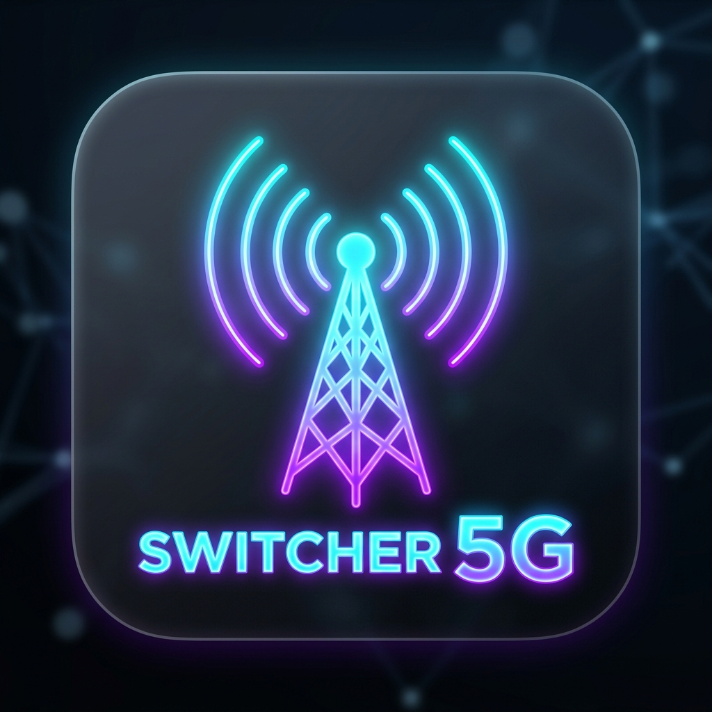
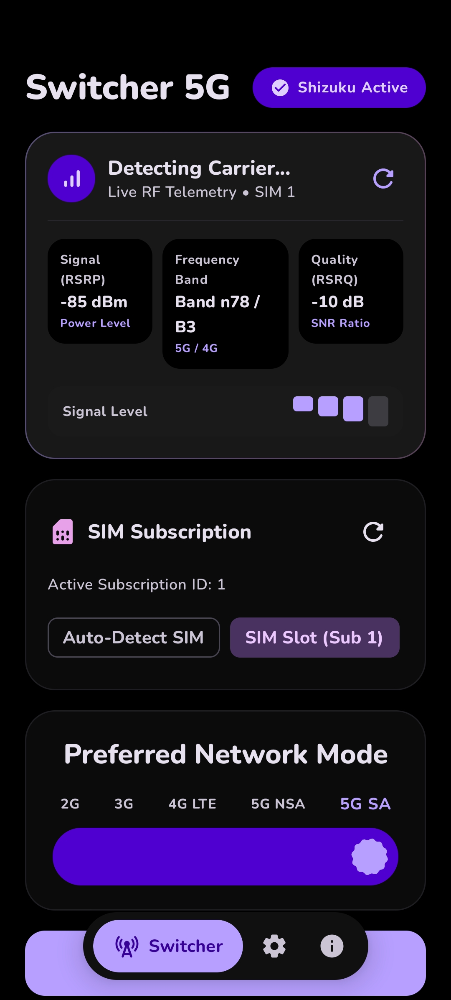
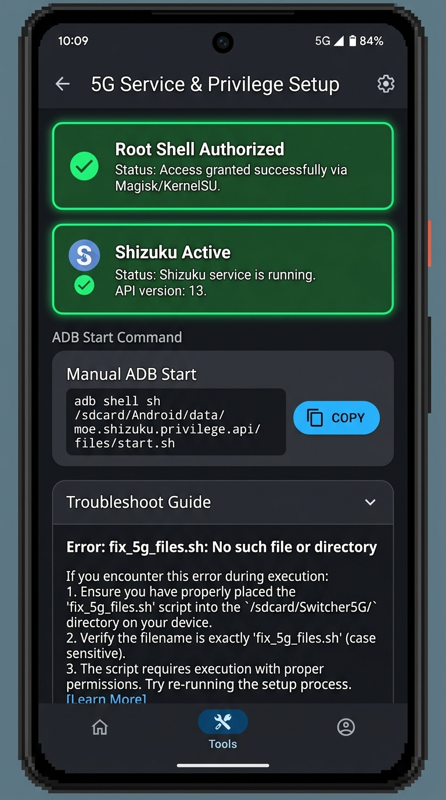
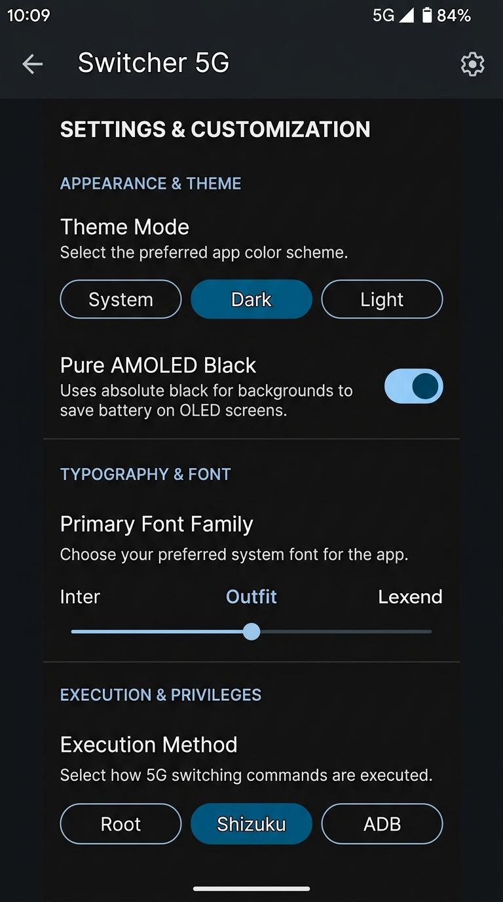

# Switcher 5G

<div align="center">

  

  <h2>Switcher 5G</h2>

  <h3>5G Standalone (SA), 5G Non-Standalone (NSA), and 4G LTE Network Switcher for Android</h3>

  [](https://github.com/shreyagarwal72/switcher5G/releases/latest)
  [](https://github.com/shreyagarwal72/switcher5G/releases/latest)
  [](https://t.me/championworkspace)
  [](https://github.com/shreyagarwal72/switcher5G/actions)
  [](LICENSE)

  <br />

  <a href="https://github.com/shreyagarwal72/switcher5G/releases/latest">
    
  </a>

</div>

---

## 📱 Real-Time UI Screenshots

<div align="center">

| **Dashboard & Mode Switcher** | **Shizuku & Root Setup** | **Settings & Customization** |
| :---: | :---: | :---: |
|  |  |  |

</div>

---

## 🚀 Key Features

* **1-Tap Network Mode Switching**: Switch instantly between **5G SA (NR Only)**, **5G NSA (NR / LTE)**, and **4G LTE Only** via Shizuku IPC or Root (`su`) shell.
* **Dual-SIM (SIM1 & SIM2) Support**: Select active subscription slot (SIM 1 or SIM 2) dynamically on dual SIM mobile devices.
* **1-Tap Home Screen App Widget**: Perform 1-tap background network mode switching directly from your Android Home Screen without opening settings.
* **Dual Quick Settings (QS) Tiles**:
  * **5G Power Switcher Tile**: 1-tap mode cycling directly in status bar quick settings.
  * **5G Custom 2-Mode Toggle Tile**: 1-tap toggling between user-configurable network modes.
  * **Manual 5G Settings Tile**: 1-tap shortcut to open system `RadioInfo` testing menu (`*#*#4636#*#*`).
* **Android 14 Predictive Back & Motion**: Full predictive back gesture support with Material 3 Shared Axis motion transitions.
* **Root (`su`) & Shizuku First-Class Support**: Native Kotlin `RootHelper` execution for rooted users, and Shizuku binder IPC for unrooted users.
* **System Testing Menu Resolver**: Native fallback resolution for hidden testing activities across OEM devices (AOSP `RadioInfo`, `TestingSettings`, Qualcomm `MobileNetworkSettings`, MediaTek `EngineerMode`, Samsung `ServiceModeApp`).
* **Scalloped Stride Slider Controls**: Rolling scalloped slider controls with physical rotation dynamics for network mode selection, typography, color palettes, and color styles.
* **Dynamic Theming & Customization**:
  * 10 curated color palettes (Default, M3 Expressive, Violet, Emerald, Crimson, Sunset, Oceanic, Cyberpunk, Amber Gold, Midnight).
  * 9 Material You color styles (Tonal Spot, Neutral, Vibrant, Expressive, Rainbow, Fruit Salad, Monochrome, Fidelity, Content).
  * Dynamic wallpaper colors (Android 12+ Material You).
  * Pure AMOLED black mode (`#000000`).
  * 7 live typography fonts (System, Nunito, Inter, Outfit, Lexend, Manrope, Space Grotesk).
* **Telegram Support & Community**: Direct integration with [@championworkspace](https://t.me/championworkspace) for instant support, updates, and discussions.
* **Automated Update Tracker**: Checks for release APK updates directly from GitHub Releases API with in-app 1-tap download and installation.

---

## 📥 Download

Get the latest signed release APK directly from GitHub Releases:

<div align="center">

| Release | Download Link | Type |
| :--- | :--- | :--- |
| **v1.0.2 (Latest Release)** | [**Download switcher5g-release.apk**](https://github.com/shreyagarwal72/switcher5G/releases/latest) | Signed Production APK |

</div>

---

## 🛠️ Setup Instructions

### Option 1: Shizuku Service (Recommended — No Root Required)
1. Install and open the **[Shizuku App](https://shizuku.rikka.app/)**.
2. Start Shizuku via **Wireless Debugging** (Android 11+) or via PC terminal (`adb shell`).
3. Open **Switcher 5G** and tap **Request Shizuku Permission**.
4. Select your preferred network mode and tap **Apply**.

### Option 2: Direct Root Access (su)
1. If your device is rooted with Magisk, KernelSU, or APatch, tap **Grant Root (su) Access** in the setup dialog.
2. Select your target SIM slot (SIM 1 or SIM 2) and preferred 5G network mode.

### Option 3: Manual 5G Switch (System RadioInfo)
1. Tap **Manual 5G Switch (System RadioInfo)** on the Home screen or tap the **Manual 5G Settings** Quick Settings tile.
2. Under **Set Preferred Network Type**, select `NR only` (5G SA), `NR/LTE` (5G NSA), or `LTE only` (4G).

---

## 💻 Command Line & Deep Link Triggers

Broadcast intent triggers from Termux or ADB terminal:

```bash
# Force 5G SA (NR Only)
am broadcast -a com.app.switcher5g.SET_NETWORK_MODE --es mode "NR_ONLY"

# Force 5G NSA (NR / LTE)
am broadcast -a com.app.switcher5g.SET_NETWORK_MODE --es mode "NR_LTE"

# Force 4G LTE Only
am broadcast -a com.app.switcher5g.SET_NETWORK_MODE --es mode "LTE_ONLY"

# Deep Link Trigger
am start -a android.intent.action.VIEW -d "switcher5g://switch?mode=NR_ONLY"
```

---

## 💬 Community & Support

Join our official Telegram community for instant support, feature requests, updates, and announcements:
👉 **[t.me/championworkspace](https://t.me/championworkspace)**

---

## 🔐 Security & Signing Key

All official release builds are compiled using a permanent cryptographic signing key. This guarantees that all future updates published on GitHub Releases can be installed seamlessly over existing installations without encountering signature mismatch errors.

---

## 📜 License

Distributed under the MIT License. See `LICENSE` for details.
